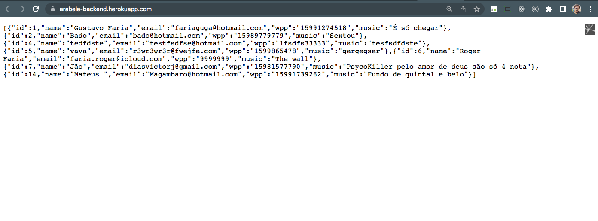
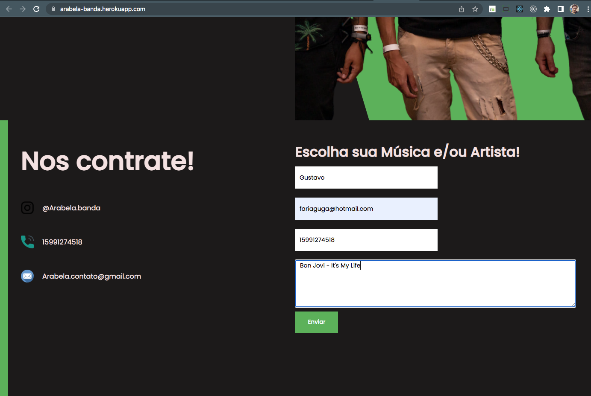

# 📦 API ARABELA BANDA - FRONTEND

Criação de uma API utilizando React.js | Node.js | MySQL | Docker | Heroku 

Frontend: https://arabela-banda.herokuapp.com/
Backend: https://arabela-backend.herokuapp.com/
Repository Backend: https://github.com/fariaguga/arabela-backend

## 🛠️ Construído com

* [ReactJs](https://reactjs.org/) - A JavaScript library for building user interfaces
* [Sequelize](https://www.npmjs.com/package/sequelize) - Promise-based Node.js ORM for MySQL
* [Express](https://expressjs.com/) - Web framework for Node.js
* [Cors](https://www.npmjs.com/package/cors) - Package for providing a Connect/Expresss
* [Axios](https://axios-http.com/docs/intro) - Promise based HTTP
* [Heroku](https://heroku.com/) - Platform as a Service
* [Supabase](https://supabase.com/) - Postgres database

## :man: Lista de usuários e músicas rodando na porta :3000

## :no_good_man: Adicionar Formulário | http://localhost:3000/user

